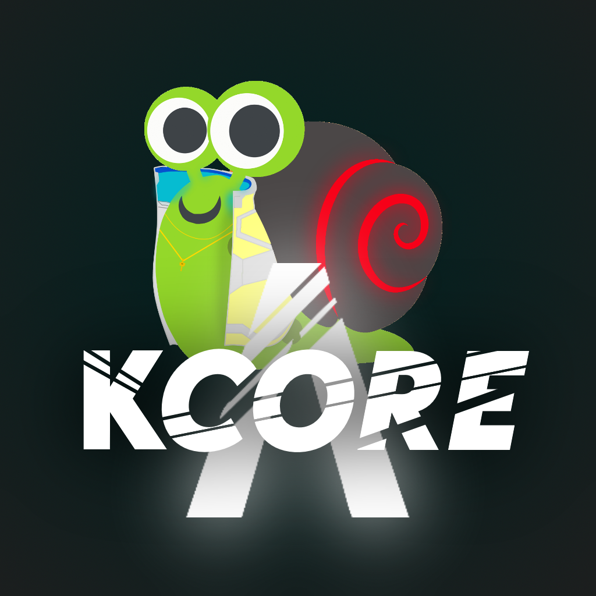
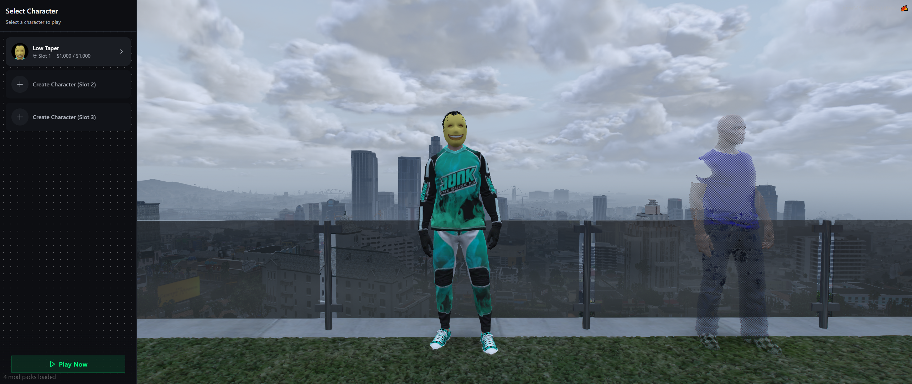
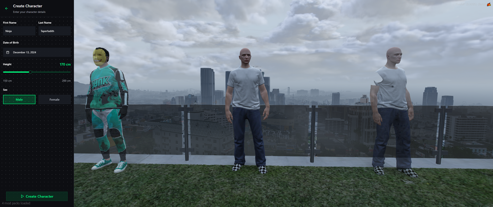
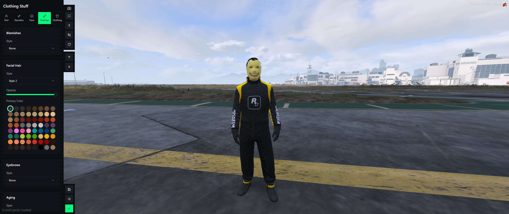
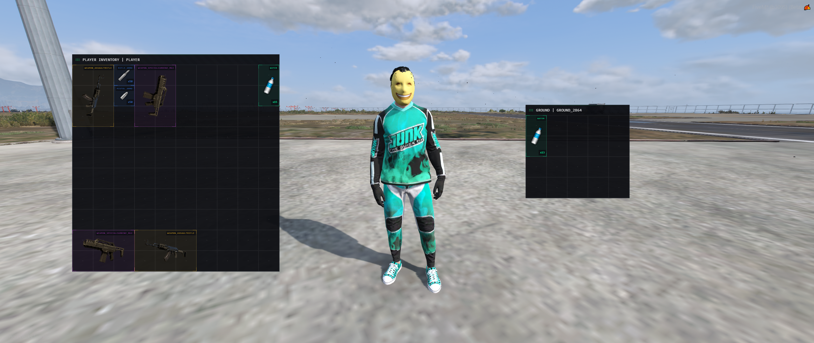

# kCore Framework | Coming soon...
## [Discord](https://discord.gg/5Da9eCfEec)
## Note: This is a work in progress and a hobby project.

<kbd></kbd>

A modern, user-friendly roleplay framework for FiveM servers, designed with simplicity and performance in mind.

## Overview

kCore provides a robust foundation for FiveM roleplay servers with features including:

> Character system with multiple character slots
>
> Integrated inventory management
>
> Modern UI components
>
> Seamless character customization
>
> Stats tracking (hunger/thirst)
>
> Economy system with cash/bank handling
>
> Persistent data storage
>
> Easy-to-use exports system

Built with both developers and players in mind, kCore offers a clean, efficient codebase while maintaining an intuitive user experience.

## Interface Preview | please remeber this is a work in progress and might change.

</kbd>
    <kbd></kbd>
    <kbd></kbd>
    <kbd></kbd>
    <kbd></kbd>

